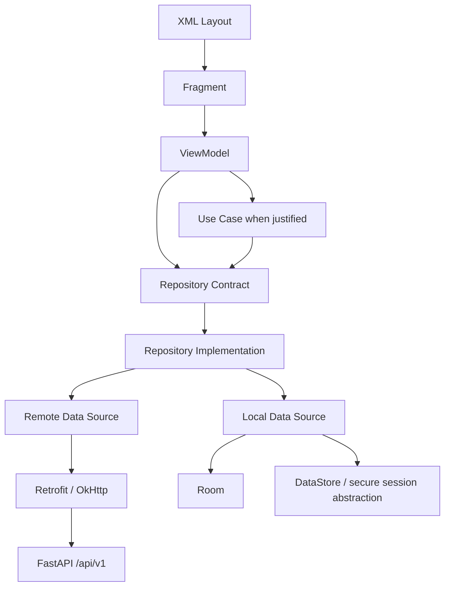

# Matrigluco Android Architecture Contract

**Status:** Non-negotiable implementation contract  
**Architecture:** Pragmatic Clean Architecture + MVVM  
**Governing baseline:** `executive-implementation-strategy.md`

The canonical Gradle module tree, source-set layout, creation order, visibility and dependency rules are defined in `project-structure-contract.md`.

## 1. Objective and proportionality

The purpose is clear, testable ownership of UI rendering, business orchestration, data policy, infrastructure, persistence and session handling. It is neither an Activity/Fragment-with-everything design nor architecture theater.

Create an abstraction only when it protects a real boundary, enables testing, isolates infrastructure, centralizes data policy, prevents duplication or lets a feature evolve independently. A one-line `repository.getProfile()` does not need a use case. Assessment submission, report review and multi-repository dashboard orchestration usually do.

Forbidden extremes:

```text
Fragment → Retrofit/DAO → JSON → validation → cache → tokens → navigation
```

```text
One endpoint → layers of pass-through interfaces/wrappers with no policy or behavior
```

## 2. Canonical dependency direction



Dependencies point inward toward stable contracts. Infrastructure types—`Response`, `Call`, `HttpException`, Room entities, DAOs, cursors and token-store implementations—do not escape data/infrastructure boundaries.

## 3. Layer contracts

### Fragment

Fragments inflate/clear ViewBinding, collect lifecycle-aware `StateFlow`, render immutable state idempotently, dispatch actions, trigger Navigation actions and show presentation-owned dialogs/sheets. They never call Retrofit/DAO/token storage, parse JSON, construct repositories, define retry/cache policy, calculate clinical results or perform business validation.

Collection uses the View lifecycle and `repeatOnLifecycle(STARTED)` or a centralized equivalent. Binding is cleared in `onDestroyView`. Rendering the same state twice must produce the same UI and must not depend on residual visibility or adapter state.

### ViewModel

ViewModels accept actions, coordinate repository/use-case calls, combine flows, expose immutable state and emit deliberate one-off effects. They may use `SavedStateHandle` for resource IDs, safe filters, selected tabs and reconstructible navigation state.

They never reference Views, Activities, Fragments, adapters, layout inflation, Retrofit, RoomDatabase, SharedPreferences or normal-logic `Context`. They never put tokens, complete medical records, report text, assessment vectors or chat history in `SavedStateHandle`.

Use `viewModelScope`; `GlobalScope` is forbidden. Cancellation is preserved—never swallow `CancellationException`.

### Use case

Optional. Use for meaningful workflow order, multiple repositories or domain/product validation. Examples: `RunAssessmentUseCase`, `SubmitReportReviewUseCase`, `SendAssistantMessageUseCase`. Simple CRUD may use ViewModel → repository directly.

### Repository

Repositories own data policy: authority, cache eligibility, refresh/staleness, remote/local reconciliation, offline behavior and logout cleanup. They return domain results or typed application errors, not transport/persistence types. They never render strings, navigate or reference UI classes.

### Remote data source

Owns Retrofit service calls, DTOs and transport response handling. It does not own screen state, navigation, clinical interpretation or user messages.

### Local data source

Owns DAOs, Room queries/writes, DataStore and secure session persistence abstractions. It executes persistence operations but does not decide product cache policy; the repository does.

## 4. Model separation and mapper ownership

Keep wire DTO, domain model, Room entity and UI model distinct wherever schemas/lifecycles differ:

```text
HealthMeasurementDto → HealthMeasurement ←→ HealthMeasurementEntity
                              ↓
                  HealthMeasurementUiModel
```

- DTOs model exact FastAPI snake_case, nullability, enum strings and envelopes.
- Entities include account ownership, remote ID, cache timestamps and sync metadata.
- Domain models express stable product/medical meaning without Android or infrastructure annotations.
- UI models contain presentation-ready labels/formatting and are never canonical medical models.

A DTO must not also be a Room entity, RecyclerView row and domain object. Feature-owned mappers handle DTO↔domain, entity↔domain and domain→UI. No global `MapperUtils.kt`; complex mapping never lives in an adapter. Critical assessment, blood-pressure, report-state and request mappers require exact tests.

## 5. Authority and cache policy

| Data | Authority | Local policy |
|---|---|---|
| Authentication/account/session | FastAPI/session service | secure refresh material; non-secret metadata only elsewhere |
| Assessment result/risk/model/snapshot | persisted FastAPI/MySQL result | optional bounded summary cache; never recalculate |
| Health measurements | FastAPI/MySQL | account-scoped cache where offline value is approved |
| Reports/files/status | FastAPI/MySQL + private storage | metadata only by explicit policy; raw files excluded by default |
| Consultations/status | FastAPI/MySQL | list cache only if useful; unsupported capabilities omitted |
| Notifications | FastAPI/MySQL | account-scoped inbox cache may be useful |
| Assistant conversations | FastAPI/MySQL/backend runtime | no message-body cache by default |
| Consent | FastAPI/MySQL | server-authoritative |

Every Room cache defines account key, source timestamp, expiry/refresh, stale presentation and logout behavior. Remote IDs alone are insufficient account isolation. Logout/session invalidation cancels account work and clears or securely isolates the account cache. A new user must never see the previous user's data.

## 6. Repository and error boundary

Repository APIs are domain-oriented and may expose `Flow`, paging abstractions and suspend mutations. They do not expose Retrofit `Response`, `HttpException`, entities or cursors.

Data layers return normalized, resource-independent errors matching `network-error-contract.md`. They do not depend on `UiText` or Android string resources. Presentation maps safe codes/fields into controlled `UiText`; raw FastAPI detail, SQL text, exceptions and stack traces are never blindly displayed.

Retry policy belongs with data/workflow policy. Distinguish idempotent GET retry, ambiguous POST behavior, manual retry and WorkManager retry. Endless Fragment retry loops are forbidden.

## 7. State, actions and effects

Use immutable feature-specific state exposed as `StateFlow`; mutable flows remain private. Major visibility derives from one state model, not independent callbacks. Complex workflows may use reducer-style updates without introducing an unnecessary MVI/Redux framework.

- **State:** current content, selection, loading, offline/error, refresh or mutation status.
- **Action:** meaningful user intent such as retry, submit, select metric or delete record.
- **Effect:** navigation, Snackbar, document picker or session exit.

One-time events never live permanently in state. Use a deliberate lifecycle-safe `Channel`/`SharedFlow` mechanism; `SingleLiveEvent` is prohibited. Avoid action types for trivial local events when a direct ViewModel method is clearer.

`UiText` is presentation-only and supports resource text plus narrowly controlled dynamic text. Backend strings are dynamic UI text only after safety review.

## 8. Mutation and medical safety

Important mutations explicitly model Idle/Editing/Invalid/Submitting/Success/Failure and `PendingSync` only when a real durable queued contract exists. Do not show a reading saved, assessment completed, consultation booked or report corrected before server confirmation or an explicitly supported pending state. Rotation, recreation and repeated collection must not duplicate submissions.

Android never calculates risk bands, probability, diagnoses, clinical thresholds, medication advice, report interpretation or consultation urgency. It renders persisted assessment result, probability, model version and feature snapshot. Offline assessment preserves safe form state and explains that connection is required; it never runs ML or fabricates a result.

Animations cannot imply persistence before confirmation.

## 9. Navigation and process reconstruction

Pass stable identifiers—assessment, report, consultation and conversation IDs—not large domain/medical objects. Destinations reconstruct through arguments, safe saved state and repository reload. Do not put PHI-heavy objects into Bundles. Process death restoration must not rely on a large in-memory object passed between Fragments.

Cross-feature navigation uses destination contracts/action IDs rather than importing implementation classes where module structure permits.

## 10. Feature and module ownership

A feature owns its Fragment, ViewModel, state, meaningful actions/effects, UI models, feature mappers, navigation entry and domain-facing repository/use-case surface where appropriate. Shared infrastructure belongs in core.

A type belongs in `core:*` only if at least two features need it and its semantics are truly shared. Features do not depend arbitrarily on other feature implementations; shared coordination occurs through repository/core contracts, navigation contracts or app-level orchestration.

Phase 1 begins with meaningful foundation modules only. Feature modules are created when their implementation phase begins, never as empty shells.

## 11. RecyclerView/XML rules

Adapters receive immutable UI models and render them with `ListAdapter`/`DiffUtil`, or Paging adapters only where approved. They never access repositories, request network data, calculate clinical status or hide domain logic. Loading/empty/error are screen state, not fake rows, except dedicated Paging load-state infrastructure.

XML may have loading/content/empty/offline/error containers, but one state determines visibility. Independent coroutines must not race to toggle them.

## 12. Coroutines and execution

Retrofit suspending calls and Room suspend APIs manage their normal execution. Do not scatter `Dispatchers.IO`. Inject dispatchers for genuine blocking/CPU work where isolation and tests benefit. Searches, filtering, Assistant calls and detail loads respect structured cancellation.

## 13. Test contract

- ViewModel tests cover relevant state/effect transitions, offline-with/without-cache and duplicate mutation prevention.
- Repository tests verify policy: successful refresh updates cache, offline can return valid cache, failure does not overwrite good cache, logout clears account data, and failed assessment POST never creates a completed local assessment.
- Mapper tests verify exact contract translation and units.
- Error mapping is independently tested.
- Test doubles replace repositories/data sources only in tests; production runtime fake providers are forbidden.

## 14. Enforced boundaries

Use Gradle module dependencies and Kotlin visibility where practical so feature UI cannot reach Room implementation or instantiate Retrofit, core network cannot depend on feature UI, and features cannot import unrelated feature implementations. Hilt supplies Retrofit, OkHttp, Room, DataStore, repositories and justified use cases; Fragments/ViewModels do not instantiate them.

Avoid semantic dumping grounds such as `Utils`, `CommonUtils`, `Helper` or generic `Manager`. Prefer precise names such as `ApiErrorMapper`, `MeasurementFormatter` and `DateTimeFormatter`.

## 15. Feature architecture review gate

Before feature completion, answer:

1. Where does state live and who owns data policy?
2. What is authoritative and what, if anything, is cached?
3. What happens loading, content, empty, offline and on error?
4. What happens to mutations offline or after ambiguous failure?
5. What happens on logout/account switch?
6. Does any Fragment/adapter call infrastructure or contain product/clinical rules?
7. Does any DTO/entity leak into UI?
8. Are effects separate from state and mutations duplicate-safe?
9. Can the ViewModel, repository policy and critical mappers be tested independently?

If an answer is unclear, the feature architecture is incomplete.

## 16. Acceptance criteria

- Fragments render/dispatch only and clear binding correctly.
- ViewModels contain no Android Views and expose immutable `StateFlow`.
- Use cases exist only for meaningful orchestration.
- Repositories own policy; data sources own infrastructure.
- DTO/domain/entity/UI separation is deliberate and tested.
- Server-owned medical state remains server-authoritative.
- Caches are account-scoped, stale-aware and logout-safe.
- Every major screen evaluates the five-state checklist and documents impossible states.
- Effects are one-off and lifecycle-safe; no `SingleLiveEvent`.
- Sensitive mutations are never optimistically confirmed without a real contract.
- No offline ML or Android-derived risk/clinical interpretation.
- IDs, not medical payloads, cross navigation boundaries.
- Configuration changes/process recreation do not duplicate work.
- Gradle boundaries prevent invalid dependencies where practical.

## 17. Definition of done

A new engineer can identify each major feature's Fragment, ViewModel, state/actions/effects, domain model, repository boundary, data sources, source of truth, offline/error/cache/logout policy and tests without guessing. No screen leaves business logic, persistence or state ownership ambiguous.
