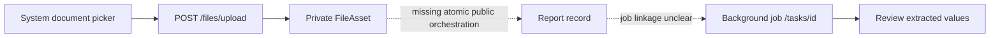

# Mobile API Contract

**Base prefix:** `/api/v1`  
**Authentication:** `Authorization: Bearer <access JWT>` wherever Auth is Yes.  
**Errors:** validation is normally 422; authenticated resources may return 401/403/404; conflicts and throttling are represented by the centralized backend error policy. Android must decode the server error body, not infer from messages.

## Registered mobile-relevant routes

| Feature | Method | Path | Auth | Request/parameters | Response/success | Android status |
|---|---|---|---:|---|---|---|
| Health | GET | `/health`, `/health/live` | No | none | liveness, 200 | Diagnostic only |
| Health | GET | `/health/ready` | No | none | readiness, 200/503 | Diagnostic only |
| Auth | POST | `/auth/register` | No | `RegisterRequest` | `TokenPairResponse`, 201 | SUPPORTED |
| Auth | POST | `/auth/signup` | No | same; legacy alias | same, 201 | Do not use |
| Auth | POST | `/auth/login` | No | `LoginRequest` | token pair, 200 | SUPPORTED |
| Auth | POST | `/auth/refresh` | No | `RefreshRequest` | rotated token pair, 200 | SUPPORTED |
| Auth | GET | `/auth/me` | Yes | none | `UserResponse` | SUPPORTED |
| Auth | POST | `/auth/logout` | No | optional `LogoutRequest` | 204 | PARTIAL: token required to revoke |
| Auth | POST | `/auth/logout-all` | Yes | none | 204 | SUPPORTED |
| Auth | GET | `/auth/sessions` | Yes | none | `SessionListResponse` | SUPPORTED |
| Auth | DELETE | `/auth/sessions/{session_id}` | Yes | path ID | 204 | SUPPORTED |
| Auth | POST | `/auth/change-password` | Yes | current/new password | message | SUPPORTED |
| Auth | POST | `/auth/forgot-password` | No | email | non-enumerating message | SUPPORTED |
| Auth | POST | `/auth/reset-password` | No | token/new password | message | SUPPORTED |
| Auth | POST | `/auth/verify-email` | No | token | message | SUPPORTED |
| Auth | POST | `/auth/resend-verification` | No | email | message | SUPPORTED |
| User | GET/PATCH | `/users/me` | Yes | none / `UserUpdate` | `UserResponse` | SUPPORTED |
| Profile | GET/PATCH | `/profiles/me` | Yes | none / `ProfileUpdate` | `ProfileResponse` | SUPPORTED |
| Pregnancy | GET/POST | `/pregnancies` | Yes | none / `PregnancyCreate` | list / item 201 | SUPPORTED |
| Pregnancy | GET/PATCH/DELETE | `/pregnancies/{pregnancy_id}` | Yes | ID / update | item / 204 | SUPPORTED |
| Assessment | POST | `/predictions` | Yes | `PredictionCreateRequest` | `PredictionDetailResponse`, 201 | SUPPORTED |
| Assessment | GET | `/predictions` | Yes | page, page_size, risk_band, source | paged list | SUPPORTED |
| Assessment | GET/DELETE | `/predictions/{prediction_id}` | Yes | ID | detail / 204 | SUPPORTED |
| Assessment | GET | `/predictions/model-info` | No | none | model card | SUPPORTED |
| Assessment | POST/GET | `/predictions/predict`, `/save`, `/history` | mixed | legacy DTOs | legacy DTOs | Do not use |
| Measurement | POST/GET | `/health-measurements` | Yes | create / filters + page | item 201 / paged list | SUPPORTED |
| Measurement | GET/PATCH/DELETE | `/health-measurements/{measurement_id}` | Yes | ID / update | item / 204 | SUPPORTED |
| History | GET | `/history` | Yes | types, date_from/to, month, page, page_size | unified paged events | SUPPORTED |
| Dashboard | GET | `/dashboard/summary` | Yes | none | `DashboardSummaryResponse` | SUPPORTED |
| Private file | POST | `/files/upload` | Yes | multipart field `file` | `FileAssetResponse`, 201 | SUPPORTED |
| Private file | GET/DELETE | `/files/{file_id}/download`, `/files/{file_id}` | Yes | ID | stream / 204 | SUPPORTED |
| Report | GET/POST | `/reports` | Yes | limit / `SaveReportRequest` | list / item 201 | PARTIAL |
| Report | GET/PATCH/DELETE | `/reports/{report_id}` | Yes | ID / `UpdateReportRequest` | item / 204 | SUPPORTED after creation |
| Report | GET | `/reports/{report_id}/pdf` | Yes | ID | private no-store PDF | SUPPORTED |
| Job | GET | `/tasks/{job_id}` | Yes | ID | `BackgroundJobRead` | SUPPORTED |
| Job | GET | `/tasks` | Yes | page, page_size, status, job_type | paged jobs | SUPPORTED |
| Consultation | GET/POST | `/consultations` | Yes | limit / appointment DTO | list / item 201 | PARTIAL records only |
| Consultation | GET/PATCH/DELETE | `/consultations/{consultation_id}` | Yes | ID / update | item / 204 | PARTIAL records only |
| Notification | GET | `/notifications` | Yes | read/type filters + page | paged list + unread count | SUPPORTED |
| Notification | GET/PATCH | `/notifications/preferences` | Yes | none / update | preferences | SUPPORTED |
| Notification | GET | `/notifications/{notification_id}` | Yes | ID | item | SUPPORTED |
| Notification | PATCH | `/notifications/{notification_id}/read` | Yes | ID | message | SUPPORTED |
| Notification | PATCH | `/notifications/read-all` | Yes | none | message | SUPPORTED |
| Assistant | POST/GET | `/chatbot/conversations` | Yes | create / none | item 201 / list | SUPPORTED |
| Assistant | GET/PATCH/DELETE | `/chatbot/conversations/{id}` | Yes | ID / update | item / 204 | SUPPORTED |
| Assistant | GET/POST | `/chatbot/conversations/{id}/messages` | Yes | none / `MessageCreate` | list / message | SUPPORTED |
| Assistant | POST | `/chatbot/conversations/{id}/stream` | Yes | `MessageCreate` | SSE `data:` tokens + `[DONE]` | PARTIAL protocol |
| Assistant | POST | `/chatbot/messages/{message_id}/feedback` | Yes | rating ±1, comment | untyped body | PARTIAL |

`/api/v1/admin/chatbot/models` (GET/POST) and `/api/v1/admin/chatbot/knowledge` (GET) are registered administrative routes and are **not Android patient-app contracts**. Hidden aliases (`profiles/current`, `files/download/{id}`, consultation/report user routes) and the entire legacy `/api` router must not be used by new Android code.

## Important DTO notes

- `TokenPairResponse`: access token, bearer type, expiry seconds, optional refresh token, untyped user map.
- Lists are inconsistent: predictions/jobs use nested `pagination`; measurements/history/notifications use top-level page fields; reports/consultations/chat lists are limited arrays.
- Files accept PDF, JPEG and PNG; configured maximum is 10 MiB. Content signature is validated server-side.
- Ownership is supplied by authenticated identity; Android must not send or trust arbitrary `user_id` fields.
- API errors use `backend/app/schemas/common.py`; preserve request IDs for support but never log payloads/tokens.

## Assessment field contract

Source: `backend/app/schemas/prediction.py` and `backend/app/ml/inference/feature_contract.py`.

| Model concept | JSON property | Type | Required at HTTP boundary | Unit | Validation |
|---|---|---|---:|---|---|
| Prior pregnancies | `pregnancies` | number | No; backend may impute | count | 0–25 |
| Glucose | `glucose` | number | Yes | mg/dL | 40–500 |
| Diastolic BP | `blood_pressure` | number | Yes | mmHg | 40–250 |
| Skinfold | `skin_thickness` | number | Yes | mm | 5–120 |
| Insulin | `insulin` | number | Yes | µU/mL | 1–1000 |
| BMI | `bmi` | number | Conditional | kg/m² | 10–80 |
| Pedigree score | `diabetes_pedigree_function` | number | Yes | score | 0.05–3.0 |
| Age | `age` | number | Yes | years | 15–110 |

If BMI is omitted, `weight_kg` (30–300) and `height_cm` (100–250) are derivation inputs; both must be collected together. Optional `hba1c` (3–20 %) is context only and does not influence the eight-feature model. Android must use `diabetes_pedigree_function`, not the legacy `diabetes_pedigree`. It must not copy legacy zero defaults, calculate probability/risk bands, load `.pkl`/`.joblib`, or rerun inference when viewing stored results.

## Verified flow boundaries

```mermaid
sequenceDiagram
  participant A as Android
  participant API as FastAPI
  A->>API: POST /auth/login
  API-->>A: access JWT + opaque refresh token
  A->>API: Bearer request
  API-->>A: 401 when access cannot be accepted
  A->>API: POST /auth/refresh (single flight)
  API-->>A: rotated token pair or failure
  Note over A: On failure clear local session; never loop
```

The intended report flow is not yet a verified single contract:


