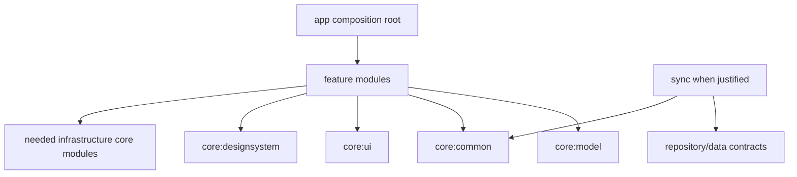

# Matrigluco Android Project Structure Contract

**Status:** Canonical module and source-layout contract  
**Applies from:** Phase 1  
**Architecture authority:** `android-architecture.md`

## 1. Actual root and target evolution

The existing Android project root is `D:/Matrigluco/frontend/`. Phase 1 must evolve that project incrementally; this document does not authorize renaming it to `MatriglucoAndroid/`, deleting useful existing files, or creating the full mature tree at once. A root rename requires an explicit repository/product decision.

The architectural destination is feature-first and multi-module:

```text
frontend/
├── app/
├── core/
│   ├── common/
│   ├── model/
│   ├── designsystem/
│   ├── ui/
│   ├── network/
│   ├── datastore/
│   ├── auth/
│   ├── testing/
│   ├── database/       # only when a cache-backed feature requires Room
│   └── notifications/  # only when Android OS delivery is implemented
├── feature/
│   ├── startup/
│   ├── auth/
│   ├── onboarding/
│   ├── dashboard/
│   ├── assessment/
│   ├── tracking/
│   ├── history/
│   ├── reports/
│   ├── assistant/
│   ├── consultations/
│   ├── notifications/
│   ├── account/
│   └── about/
├── sync/               # only when a real WorkManager workflow exists
├── benchmark/          # release-hardening phase
├── build-logic/
├── gradle/
├── docs/android/
├── build.gradle.kts
├── settings.gradle.kts
├── gradle.properties
└── README.md
```

This is a destination, not a Phase 1 creation checklist.

## 2. Dependency contract



Feature modules must not depend directly on other feature implementations. Cross-feature behavior uses navigation contracts, shared domain/repository contracts or app-level orchestration. Shared-data needs never turn one feature into another feature's infrastructure.

Use `implementation` by default. Use `api` only when public types intentionally expose the dependency. Circular dependencies indicate a wrong boundary and must be redesigned, not hacked around.

## 3. Initial Phase 1 module set

Create modules incrementally and only when each has immediate responsibility. The maximum sensible Phase 1 foundation set is:

```text
:app
:core:common
:core:model
:core:designsystem
:core:ui
:core:network
:core:datastore
:core:auth
:core:testing
:feature:startup
:feature:auth
```

Even this list is subject to incremental build validation. `:core:database`, `:sync`, `:benchmark`, future feature modules and `:core:notifications` are not created until their phase has real code and tests. Do not create empty Gradle modules, package forests, placeholder classes, TODO files, workers, DAOs or repositories merely to resemble the mature tree.

Creation order:

1. Root Gradle/toolchain/version catalog.
2. Convention build logic after repeated configuration is demonstrated.
3. `core:common`, `core:model`, `core:designsystem`, `core:ui`.
4. `core:network`, `core:datastore`, `core:auth`, `core:testing`.
5. Composition-only `app` migration.
6. `feature:startup` and auth foundation.
7. Remaining modules only with their roadmap phases.

After each meaningful wave: sync, `assembleDebug`, unit tests and dependency-boundary checks.

## 4. Application identity and source roots

The current `com.example.myapplication` identity is a Phase 1 blocker. `com.matrigluco.app` is a candidate, not approved fact; choose the durable organization namespace before moving source packages or establishing release signing.

Use one Kotlin source convention consistently, preferably:

```text
<module>/src/main/kotlin/com/matrigluco/...
```

Android resources always live at source-set level:

```text
feature/dashboard/src/main/res/layout/fragment_dashboard.xml
```

Never place resources beneath `presentation/` Kotlin packages. Feature resource names may use prefixes such as `dashboard_` when collision risk justifies them. Shared design tokens stay in `core:designsystem`; feature copy/layout/drawables stay feature-local.

## 5. `:app` composition root

Target responsibilities:

```text
MatriglucoApp.kt       @HiltAndroidApp and minimal process initialization
MainActivity.kt        NavHost, adaptive shell, system bars, predictive back
AppNavigator.kt        only genuine cross-feature navigation decisions
AppState.kt            top-level authenticated/startup/navigation state
di/                    app-level composition only
res/navigation/        root and nested graph integration
```

Application startup performs no dashboard load, inference, Retrofit call or blocking I/O. MainActivity contains no login, assessment, reading or report logic. `:app` contains no feature repositories/ViewModels/business rules.

Root navigation concept:

```text
nav_root.xml
├── startup
├── nav_auth.xml
├── nav_onboarding.xml
└── nav_main.xml
```

Use nested graphs where they improve ownership; do not build one giant graph. Do not invent a standalone navigation module until modular navigation contracts genuinely require it.

## 6. Core module responsibilities

### `:core:common`

Small infrastructure-free primitives: normalized result/error contracts when useful, clock/dispatcher abstractions for genuine test needs, pagination and specific validation. No `Utils.kt`, `Helpers.kt`, generic constants/extensions or catch-all manager.

### `:core:model`

Shared domain models only. No Retrofit, Room or Android UI dependencies. Value classes such as `AssessmentId` or `MetricType` exist only when they protect an invariant or prevent misuse; do not wrap every string.

### `:core:designsystem`

Care Orbit tokens, themes, accessibility behavior, selected Hugeicons and reusable `Orbit*` visual components. Build components when at least two screens benefit; do not prebuild a speculative library. Keep naming semantic—`OrbitMetricSurface`, not automatically a Material card.

```text
src/main/res/
├── color/
├── drawable/hugeicons/
├── drawable/shapes/
├── layout/view_*.xml
├── values/{colors,dimens,styles,themes}.xml
└── values-night/
```

### `:core:ui`

Shared Android UI mechanics such as the single approved Fragment ViewBinding pattern, clear lifecycle collection helpers, `UiText`, generic RecyclerView utilities and accessibility helpers. It does not own feature components or Care Orbit styling.

### `:core:network`

OkHttp/Retrofit/Kotlinx Serialization construction, shared headers, connectivity observation, normalized transport errors, upload infrastructure and auth hooks. It is Hilt-created, not a mutable global `ApiClient`.

Feature-specific Retrofit interfaces and DTOs normally remain in feature data packages. Do not build a giant `core:network:dto` mirror of FastAPI. Connectivity indicates network availability, not FastAPI health.

The access-token interceptor only attaches credentials. A single refresh coordinator/authenticator handles 401 rotation; it never navigates or shows UI.

### `:core:datastore`

Theme/app preferences and non-sensitive session metadata only. A class called `SessionPreferences` does not gain permission to store tokens. Serializers and DI remain local to this module.

### `:core:auth`

Shared session state/policy, secure-token abstraction and the one refresh-coordination ownership model. Login/register product flows remain in `feature:auth`. Choose refresh coordinator ownership between auth/network so dependency flow is acyclic; do not duplicate it.

### `:core:database`

Created only with an approved Room cache. Contains database, specifically named entities, DAOs, mappers, migrations and DI. It does not mirror MySQL, perform networking or calculate clinical/UI state. Release migrations are explicit and tested; destructive migration requires separate approval.

### `:core:notifications`

Future Android OS channels, permission coordination, safe notification dispatch and whitelisted deep links. This is distinct from `feature:notifications`, which presents the durable FastAPI inbox. Do not create it before OS notifications are real; the backend currently has no FCM contract.

### `:core:testing`

Test-only dispatcher rule, clocks, network monitor, builders, fake repositories and MockWebServer helpers. Consumption should be limited to test configurations. Synthetic medical fixtures never enter `src/main` or release artifacts.

## 7. Feature module contract

Each implemented feature uses source-set-correct structure:

```text
feature/<name>/
├── build.gradle.kts
└── src/
    ├── main/
    │   ├── kotlin/com/matrigluco/feature/<name>/
    │   │   ├── presentation/
    │   │   ├── domain/
    │   │   └── data/
    │   ├── res/layout/
    │   ├── res/navigation/
    │   └── AndroidManifest.xml
    ├── test/             # when tests exist
    └── androidTest/      # when device/View tests exist
```

Feature-specific API interfaces/DTOs, repository implementations, remote/local sources and DI stay feature-local and `internal` where possible. A feature publicly exposes only intentional navigation/shared contracts.

Consolidate profile, security and preferences into `feature:account` initially. Split only after genuine scale/ownership/build needs emerge. Do not create feature-to-feature dependencies for dashboard/tracking/history shared health data; extract a shared repository/domain boundary only when multiple consumers actually require it.

## 8. Build logic, variants and DI

Centralize stable versions in `gradle/libs.versions.toml`; no dynamic versions. Convention plugins belong in `build-logic` only when they remove meaningful repeated configuration and must remain small/composable.

Variants may use `debug`, `staging` and `release` when staging exists. Base URL belongs to build/network configuration only; feature APIs use relative `/api/v1` routes. Never hardcode LAN/production URLs inside features. Debug tools and endpoint selectors live in debug source sets and never bring secrets into release.

Hilt modules live near what they wire. Use `@Binds` for interface→implementation and `@Provides` for construction. Do not create one enormous AppModule. Use KSP for Hilt/Room where the verified toolchain supports it; document any unavoidable kapt exception.

## 9. Shared repositories and future extraction

Feature-specific repositories remain feature-local. When dashboard, tracking and history genuinely need the same health source of truth, extract an intentional shared contract/data owner rather than depending on `feature:tracking`. Do not create `core:data`, `core:health`, `core:reports` or `core:assistant` before that shared responsibility exists.

## 10. Sync and benchmark

`:sync` is created only for an approved WorkManager workflow and depends on repository/data contracts, not feature UI. No empty workers or generic periodic sync. `:benchmark` and baseline-profile support arrive during performance/release hardening and are not Phase 1 blockers.

## 11. Naming and visibility

Use predictable semantic names: `DashboardFragment`, `DashboardViewModel`, `DashboardUiState`, `DashboardRepository`, `DashboardRepositoryImpl`, `DashboardRemoteDataSource`, `DashboardMapper`. Avoid vague Controller/Helper/Handler/Manager types. Prefer one primary type per file where helpful, without producing one-line-file theater.

Use `internal` aggressively. Repository implementations, data sources, mappers and adapters remain non-public unless a deliberate inter-module contract requires exposure.

## 12. Strict forbidden dependencies

```text
feature:*            ─X─► another feature implementation
Fragment             ─X─► Retrofit / DAO / SecureTokenStore
RecyclerView adapter ─X─► repository
API DTO              ─X─► adapter contract
Room entity          ─X─► adapter/XML
core:network         ─X─► feature presentation
core:model           ─X─► Android UI/infrastructure
sync                 ─X─► Fragment/ViewModel
```

DTO/entity data travels through explicit mapping before UI. A simple DTO may map directly to a UiModel when no domain meaning exists, but it still never leaks into adapters.

## 13. Repository documentation

The Android root README must eventually explain module architecture, variants, local/LAN emulator backend configuration, development/test/release commands and clean-build requirements. Engineers must not rely on tribal knowledge. Documentation lives in the existing workspace `docs/android/`; do not duplicate the same policy under a second Android-root docs tree unless the repository layout is deliberately changed.

## 14. Review gate

- Every module has current responsibility and production/test code or a necessary build boundary.
- `:app` is composition-only and startup is light.
- Features do not depend on feature implementations.
- Core is shared, small and semantically precise.
- DTOs, entities, domain and UI models respect the architecture contract.
- Resources are under module source sets and feature resources remain local.
- Versions/configuration are centralized; no cycles/dynamic versions.
- Hilt/KSP/build logic are scoped and testable.
- Production contains no medical fixtures or fake providers.
- Sync/database/notifications/benchmark exist only when justified.
- Sync, assemble and unit tests pass after each module wave.

## 15. Definition of done

A new engineer can locate each feature quickly, explain every module's reason to exist, see obvious UI/domain/data ownership, test features independently, reuse shared infrastructure without dumping grounds, and extend the project without feature coupling, DTO/entity leakage, build fragility or speculative modules.
